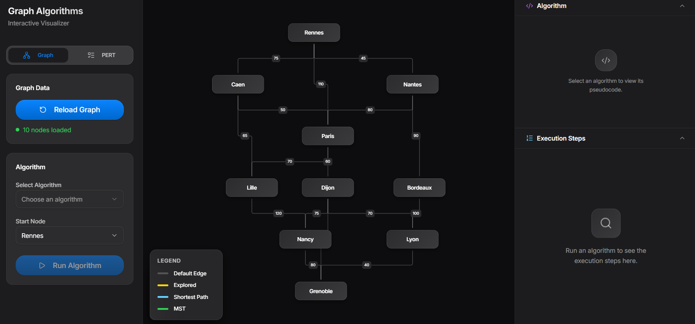
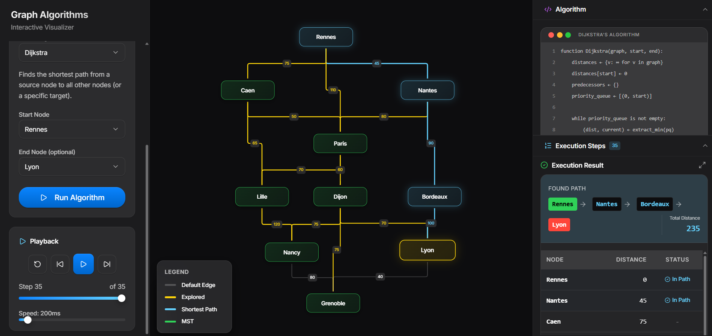
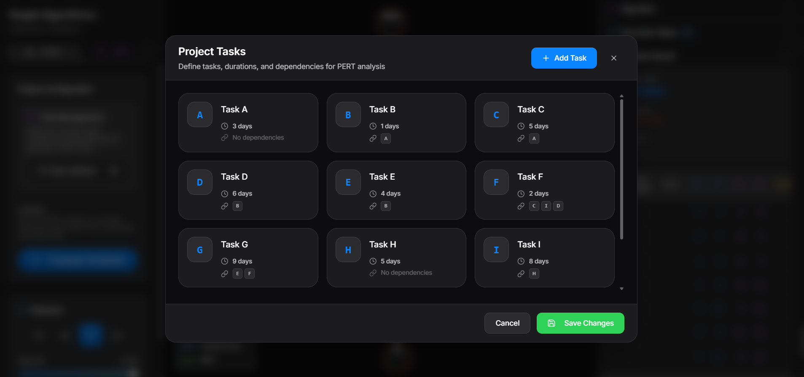

# Rapport de Projet : Algorithmes et Théorie des Graphes

**Auteurs** : BENHADDYA Loqmann & AZDAD Samy  
**Classe** : APP I1 BD/ML, EFREI 2025-2026, Semestre 5  
**Matière** : Algorithmes et Théorie des Graphes  

---

## 🚀 Présentation du Projet

Ce projet est une plateforme interactive dédiée à la visualisation d'algorithmes fondamentaux de la théorie des graphes. Nous avons développé une solution complète comprenant :
1.  **Un moteur algorithmique (Backend)** en Python capable de générer des "traces" d'exécution détaillées.
2.  **Une interface moderne (Frontend)** en React permettant de visualiser ces traces étape par étape sur des graphes réels ou des réseaux de tâches PERT.



---

## 🏗️ Architecture et Choix Techniques

Nous avons conçu ce projet avec une structure claire et modulaire pour faciliter le développement et la maintenance.

### 1. Backend : Python
*   **Pourquoi Python ?** Pour sa simplicité syntaxique et sa robustesse native dans la manipulation de structures de données (listes, dictionnaires). C'est le langage de choix pour l'algorithmique.
*   **Organisation** :
    *   `graph.py` : Structure de données fondamentale.
    *   `algorithms_*.py` : Séparation logique des familles d'algorithmes (traversal, pathfinding, trace).
    *   `api.py` : Exposition des algorithmes via une API REST légère (FastAPI).

### 2. Frontend : React + React Flow
*   **Pourquoi React ?** Pour son architecture basée sur les composants, idéale pour une interface utilisateur réactive.
*   **React Flow** : Une bibliothèque spécialisée qui nous a permis de dessiner des graphes interactifs et animés sans réinventer la roue.

### 3. Méthodologie de Travail
*   **Tracking des Tâches** : Utilisation d'un fichier `Tasks.md` centralisé pour suivre l'avancement en temps réel (TODOs cochés au fur et à mesure).
*   **Code Propre** : Noms de variables explicites (ex: `earliest_start`, `visited_nodes`) et documentation systématique (Docstrings).
*   **Convention Git** : Commits atomiques et messages descriptifs pour éviter les conflits et garder un historique lisible.

---

## 🧠 Algorithmes de Parcours

### 1. Breadth-First Search (BFS)
Le parcours en largeur explore le graphe niveau par niveau.
-   **Principe** : Utilise une **file (FIFO)** pour visiter les voisins les plus proches en premier.
-   **Extrait d'implémentation** (`algorithms_trace.py`) :
    ```python
    while queue:
        current = queue.popleft()
        path.append(current)
        
        # Enregistrement de l'étape pour la visualisation
        steps.append(Step("visit_node", current, f"Visiting node '{current}'").to_dict())
        
        for neighbor in graph.get_neighbors(current):
            # ... (traitement des voisins)
            if neighbor not in visited:
                visited.add(neighbor)
                queue.append(neighbor) # Ajout en fin de file
    ```
    > **Note** : La `queue.popleft()` garantit l'ordre FIFO essentiel au BFS, permettant d'explorer strate par strate.

[SCREENSHOT: Visualisation du BFS en cours d'exécution]

### 2. Depth-First Search (DFS)
Le parcours en profondeur explore chaque branche le plus loin possible avant de reculer.
-   **Principe** : Utilise une **pile (LIFO)**.
-   **Extrait d'implémentation** (`algorithms_trace.py`) :
    ```python
    while stack:
        current = stack.pop() # Récupération du dernier élément ajouté (LIFO)
        
        if current in visited:
            continue
            
        visited.add(current)
        # ...
        neighbors = graph.get_neighbors(current)
        for neighbor in reversed(neighbors): # Inversion pour maintenir l'ordre naturel
             if neighbor not in visited:
                stack.append(neighbor)
    ```
    > **Note** : L'utilisation de `stack.pop()` transforme le parcours en exploration en profondeur. Nous inversons les voisins avant l'ajout pour visiter les nœuds dans l'ordre croissant attendu.

---

## 📍 Plus Courts Chemins

### 1. Algorithme de Dijkstra
Le standard pour le calcul d'itinéraires sur des réseaux à poids positifs.
-   **Principe** : Algorithme glouton utilisant une file de priorité.
-   **Extrait d'implémentation** (`algorithms_trace.py`) :
    ```python
    # Initialisation : distance 0 pour le départ, infinie pour les autres
    distances = {node: float('inf') for node in nodes}
    distances[start_node] = 0
    priority_queue = [(0, start_node)]

    while priority_queue:
        current_dist, current = heapq.heappop(priority_queue) # Nœud le plus proche
        
        if new_dist < distances[neighbor]:
            distances[neighbor] = new_dist
            predecessors[neighbor] = current
            heapq.heappush(priority_queue, (new_dist, neighbor))
    ```
    > **Note** : L'utilisation de `heapq` (tas binaire) rend l'extraction du minimum très efficace ($O(\log V)$), ce qui est crucial pour la performance.



### 2. Algorithme de Bellman-Ford
-   **Usage** : Supporte les poids négatifs et détecte les cycles absorbants.
-   **Extrait d'implémentation** (`algorithms_trace.py`) :
    ```python
    # Relâchement des arêtes |V| - 1 fois
    for iteration in range(len(nodes) - 1):
        updated = False
        for u, v, weight in edges:
            if distances[u] + weight < distances[v]: # Condition de relâchement
                distances[v] = distances[u] + weight
                predecessors[v] = u
                updated = True
        
        if not updated: # Optimisation : arrêt anticipé
            break
    ```
    > **Note** : La boucle externe s'exécute $V-1$ fois car c'est la longueur maximale d'un chemin simple. Si une mise à jour est encore possible après, c'est qu'il existe un cycle négatif.

---

## 🌳 Arbre Couvrant Minimum (MST)

### 1. Algorithme de Prim
-   **Principe** : Construit l'arbre nœud par nœud en ajoutant toujours l'arête sortante la moins coûteuse.
-   **Extrait d'implémentation** (`algorithms_trace.py`) :
    ```python
    visited = {start_node}
    # File de priorité des arêtes accessibles
    edges = []
    for neighbor in graph.get_neighbors(start_node):
        heapq.heappush(edges, (weight, start_node, neighbor))
    
    while edges and len(visited) < len(graph.get_nodes()):
        weight, from_node, to_node = heapq.heappop(edges)
        
        if to_node in visited: continue # Évite les cycles
        
        visited.add(to_node)
        mst_edges.append((from_node, to_node, weight))
    ```
    > **Note** : Similaire à Dijkstra, mais la priorité est donnée au poids de l'arête seule, pas à la distance cumulée depuis l'origine.

[SCREENSHOT: Arbre Couvrant Minimum visualisé sur le graphe]

### 2. Algorithme de Kruskal
-   **Principe** : Sélectionne les arêtes les moins lourdes globalement et les fusionne si elles ne créent pas de cycle.
-   **Extrait d'implémentation** (`algorithms_trace.py`) :
    ```python
    edges.sort(key=lambda x: x[2]) # Tri global des arêtes par poids
    
    for node1, node2, weight in edges:
        if union(node1, node2): # Utilisation de Union-Find
            mst_edges.append((node1, node2, weight))
        else:
            # Créerait un cycle car node1 et node2 sont déjà connectés
            pass
    ```
    > **Note** : La structure `Union-Find` (avec compression de chemin) est essentielle ici pour vérifier la connectivité en temps quasi-constant.

---

## 📅 Ordonnancement PERT (Activity-on-Arrow)

Nous utilisons une approche événementielle où les nœuds représentent des étapes et les flèches des tâches.



### Calcul du Chemin Critique
Une tâche est critique si elle ne dispose d'aucune marge entre sa date au plus tôt (EET) et sa date au plus tard (LET) :

-   **Extrait d'implémentation** (`algorithms_trace.py`) :
    ```python
    # Phase 3: Analyse du Chemin Critique
    for e in aoa['edges']:
        u, v = e['source'], e['target']
        # Slack = LET(fin) - EET(début) - Durée
        slack = event_let[v] - event_eet[u] - duration
        
        if abs(slack) < 1e-6: # Tolérance pour flottants
            critical_edges.append(e['id'])
            steps.append(Step("mark_critical_edge", e['id'], "Task is Critical").to_dict())
    ```
    > **Note** : Le calcul de la marge (slack) est le cœur du PERT. Si `slack == 0`, tout retard sur cette tâche retarde le projet entier.


---

## 🛠️ Installation et Lancement

### Backend (Python 3.10+)
```bash
pip install -r requirements.txt
python api.py
```

### Frontend (Node.js)
```bash
cd frontend
npm install # ou pnpm
npm run dev
```

## 🏁 Conclusion
Ce projet illustre comment des concepts théoriques abstraits (files de priorité, relaxation d'arêtes, tri topologique) se traduisent concrètement pour résoudre des problèmes complexes comme la navigation GPS ou la gestion de projet. L'approche visuelle permet de démystifier le comportement interne de ces algorithmes "boîte noire".
